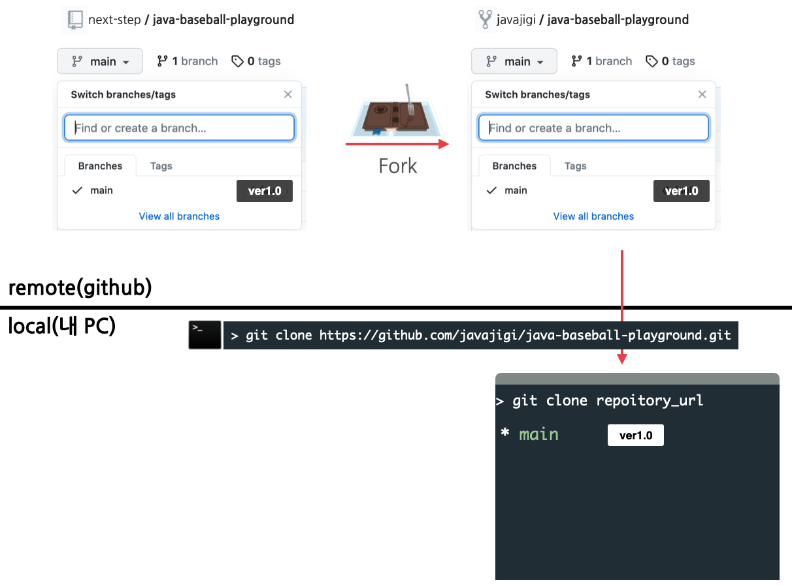
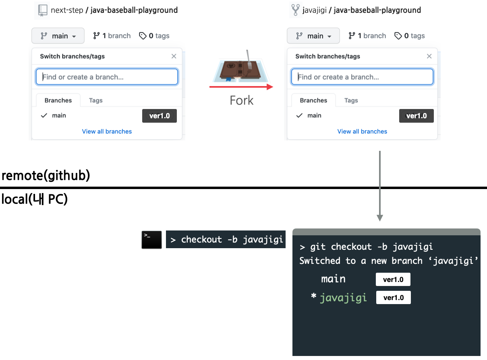
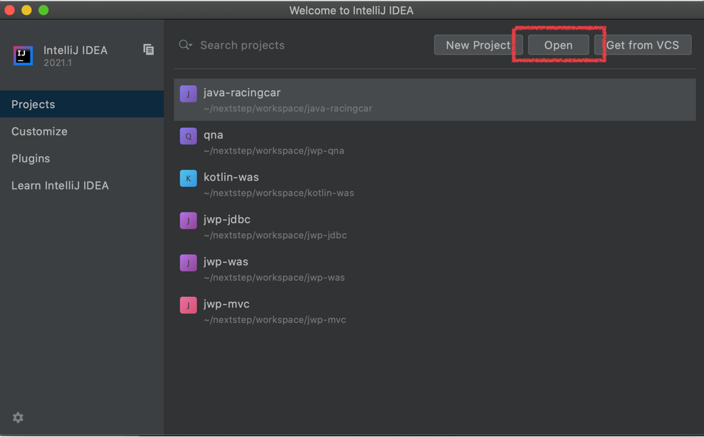
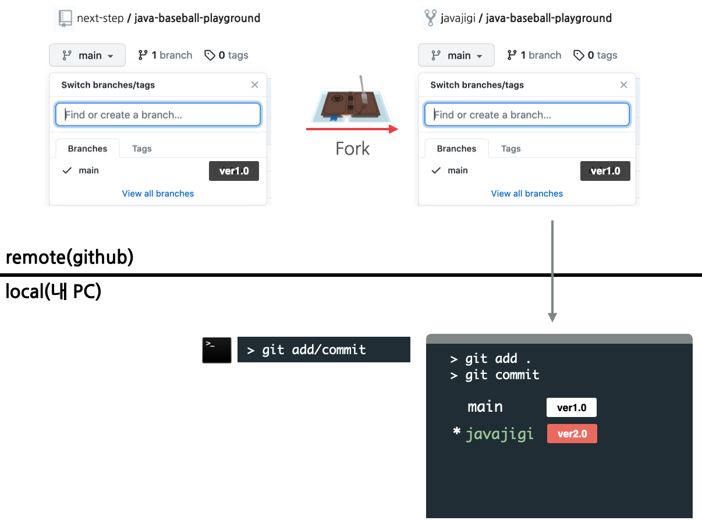
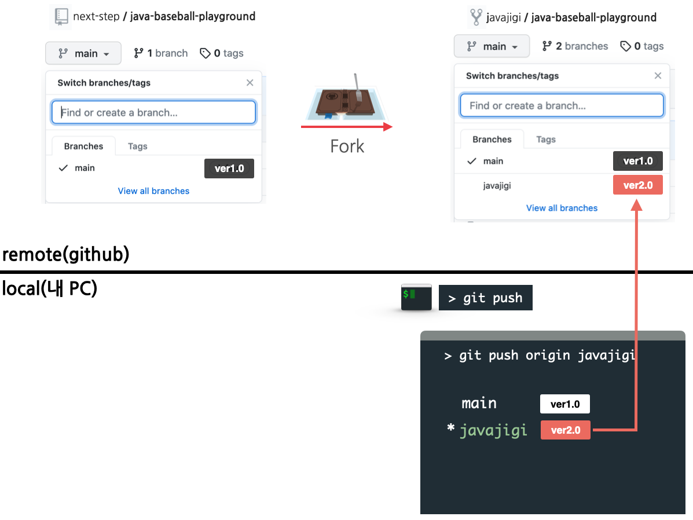
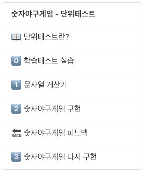

## 미션 진행 방법

---
1. 프로젝트를 자신의 계정으로 fork한다. 저장소 우측 상단의 fork 버튼을 클릭해 fork한다.
> next-step organization에 존재하는 저장소에 코드를 추가할 권한이 없기 때문에 구현한 코드를 추가할 수 없다.
> 
> fork는 next-step organization의 저장소를 자신의 계정으로 복사하는 기능이다. 앞으로 모든 미션은 자신의 계정 아래에 있는 저장소를 활용해 진행한다.

다음 그림과 같이 next-step organization 저장소 우측 상단의 fork 버튼을 클릭해 fork한다.


fork를 완료한 후의 저장소 상태는 다음과 같다.


---
2. fork한 저장소를 자신의 컴퓨터로 clone한 후 폴더로 이동한다.
> fork한 저장소는 github.com에 존재하기 때문에 소스 코드를 추가하고, 수정하는 작업을 할 수 없다.
>
> clone 명령은 github.com에 존재하는 저장소를 자신의 노트북 또는 PC로 복사하는 과정이다.

터미널에서 다음 명령을 입력한다.

```
git clone https://github.com/{본인_아이디}/{저장소 아이디}.git
ex) git clone https://github.com/javajigi/java-baseball-playground.git
```

```
// clone한 폴더로 이동하는 방법
cd {저장소 아이디}
ex) cd java-baseball-playground
```

clone을 완료한 후의 저장소 상태는 다음과 같다.


---
3. 미션 진행을 위한 브랜치 생성
> git은 서로 다른 작업을 하기 위한 별도의 공간을 생성할 때 브랜치를 생성할 수 있다.
>
> 추후 피드백을 반영하기 위해 미션을 다시 시작하기 위해 새로운 브랜치를 생성해 미션 진행할 것을 추천한다.

터미널에서 다음 명령을 입력해 브랜치를 생성한다.

```
git checkout -b 브랜치이름
ex) git checkout -b javajigi
```

브랜치를 생성한 후의 상태는 다음과 같다.


---
4. 통합개발도구(Eclipse 또는 IntelliJ)로 가져오기(import)
> 미션 진행을 위해 자신이 사용하고 있는 통합개발도구로 가져오기 한다. 이 문서는 IntelliJ를 기준으로 한다.

* IntelliJ를 시작
* 다음 화면에서 Open 버튼을 클릭해 앞에서 clone한 폴더를 선택해 프로젝트를 import한다.



---
5. 기능 구현
> 미션 요구사항을 파악해 기능을 구현한다.

---
6. 기능 구현 후 add, commit
> 기능 구현을 완료한 후 로컬 저장소에 변경된 부분을 반영하기 위해 add, commit 명령을 사용한다.

```
git status // 변경된 파일 확인
git add -A(또는 .) // 변경된 전체 파일을 한번에 반영
git commit -m "메시지" // 작업한 내용을 메시지에 기록
```

기능 구현을 완료하고 add, commit 명령을 실행한 후의 상태는 다음과 같다.


---
7. 본인 원격 저장소에 올리기
> 로컬에서 commit 명령을 실행하면 로컬 저장소에만 반영되고, 원격 github.com의 저장소에는 반영되지 않는다.

```
git push origin 브랜치이름
ex) git push origin javajigi
```

push 명령을 실행한 후의 상태는 다음과 같다.


---
## 학습 효과를 높이기 위해 추천하는 미션 진행 방법

---
1. 피드백 강의 전까지 미션 진행 
> 피드백 강의 전까지 혼자 힘으로 미션 진행. 미션을 진행하면서 하나의 작업이 끝날 때 마다 add, commit
> 예를 들어 다음 숫자 야구 게임의 경우 0, 1, 2단계까지 구현을 완료한 후 push



---
2. 피드백 앞 단계까지 미션 구현을 완료한 후 피드백 강의를 학습한다.

---
3. Git 브랜치를 main으로 변경한 후 피드백을 반영하기 위한 새로운 브랜치를 생성한 후 처음부터 다시 미션 구현을 도전한다.

```
git branch -a // 모든 로컬 브랜치 확인
git checkout main

git checkout -b 브랜치이름
ex) git checkout -b apply-feedback
```
